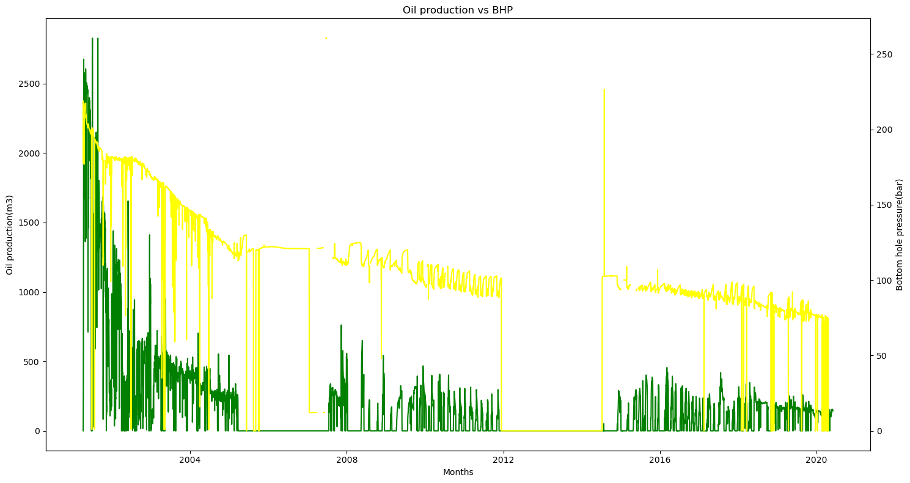

```python
import pandas as pd
import numpy as np
import matplotlib.dates as mdates
import matplotlib.pyplot as plt
%matplotlib inline
```


```python
a=pd.read_csv("Kyle master merged data csv format.csv")
a
```


<div>
<style scoped>
    .dataframe tbody tr th:only-of-type {
        vertical-align: middle;
    }

    .dataframe tbody tr th {
        vertical-align: top;
    }

    .dataframe thead th {
        text-align: right;
    }
</style>
<table border="1" class="dataframe">
  <thead>
    <tr style="text-align: right;">
      <th></th>
      <th>Date</th>
      <th>Well No.</th>
      <th>Hours Online</th>
      <th>Av. WHT (Deg C)</th>
      <th>Av. WHP (bar)</th>
      <th>Av. DHT (Deg C)</th>
      <th>Av. DHP (bar)</th>
      <th>Platform Choke %</th>
      <th>Oil (m3)</th>
      <th>Gas (m3)</th>
      <th>Produced Water (m3)</th>
      <th>Av. DHP (bar) edited</th>
    </tr>
  </thead>
  <tbody>
    <tr>
      <th>0</th>
      <td>2001-04-08</td>
      <td>29/02c - 12z</td>
      <td>6.0</td>
      <td>50.833367</td>
      <td>113.969772</td>
      <td>95.173012</td>
      <td>150.926854</td>
      <td>NaN</td>
      <td>0.0</td>
      <td>0.0</td>
      <td>5.977039</td>
      <td>150.926854</td>
    </tr>
    <tr>
      <th>1</th>
      <td>2001-04-09</td>
      <td>29/02c - 12z</td>
      <td>0.0</td>
      <td>7.873600</td>
      <td>1.013526</td>
      <td>92.106600</td>
      <td>39.609044</td>
      <td>NaN</td>
      <td>0.0</td>
      <td>0.0</td>
      <td>0.000000</td>
      <td>39.609044</td>
    </tr>
    <tr>
      <th>2</th>
      <td>2001-04-10</td>
      <td>29/02c - 12z</td>
      <td>0.0</td>
      <td>7.873600</td>
      <td>1.013526</td>
      <td>92.106600</td>
      <td>38.223179</td>
      <td>NaN</td>
      <td>0.0</td>
      <td>0.0</td>
      <td>0.000000</td>
      <td>38.223179</td>
    </tr>
    <tr>
      <th>3</th>
      <td>2001-04-11</td>
      <td>29/02c - 12z</td>
      <td>0.0</td>
      <td>7.873600</td>
      <td>1.013526</td>
      <td>92.106600</td>
      <td>43.788237</td>
      <td>NaN</td>
      <td>0.0</td>
      <td>0.0</td>
      <td>0.000000</td>
      <td>43.788237</td>
    </tr>
    <tr>
      <th>4</th>
      <td>2001-04-12</td>
      <td>29/02c - 12z</td>
      <td>0.0</td>
      <td>7.873600</td>
      <td>1.013526</td>
      <td>92.106600</td>
      <td>44.234532</td>
      <td>NaN</td>
      <td>0.0</td>
      <td>0.0</td>
      <td>0.000000</td>
      <td>44.234532</td>
    </tr>
    <tr>
      <th>...</th>
      <td>...</td>
      <td>...</td>
      <td>...</td>
      <td>...</td>
      <td>...</td>
      <td>...</td>
      <td>...</td>
      <td>...</td>
      <td>...</td>
      <td>...</td>
      <td>...</td>
      <td>...</td>
    </tr>
    <tr>
      <th>27285</th>
      <td>2020-05-28</td>
      <td>29/02C - 15a</td>
      <td>0.0</td>
      <td>NaN</td>
      <td>NaN</td>
      <td>NaN</td>
      <td>NaN</td>
      <td>NaN</td>
      <td>0.0</td>
      <td>0.0</td>
      <td>0.000000</td>
      <td>0.000000</td>
    </tr>
    <tr>
      <th>27286</th>
      <td>2020-05-29</td>
      <td>29/02C - 15a</td>
      <td>0.0</td>
      <td>NaN</td>
      <td>NaN</td>
      <td>NaN</td>
      <td>NaN</td>
      <td>NaN</td>
      <td>0.0</td>
      <td>0.0</td>
      <td>0.000000</td>
      <td>0.000000</td>
    </tr>
    <tr>
      <th>27287</th>
      <td>2020-05-30</td>
      <td>29/02C - 15a</td>
      <td>0.0</td>
      <td>NaN</td>
      <td>NaN</td>
      <td>NaN</td>
      <td>NaN</td>
      <td>NaN</td>
      <td>0.0</td>
      <td>0.0</td>
      <td>0.000000</td>
      <td>0.000000</td>
    </tr>
    <tr>
      <th>27288</th>
      <td>2020-05-31</td>
      <td>29/02C - 15a</td>
      <td>0.0</td>
      <td>NaN</td>
      <td>NaN</td>
      <td>NaN</td>
      <td>NaN</td>
      <td>NaN</td>
      <td>0.0</td>
      <td>0.0</td>
      <td>0.000000</td>
      <td>0.000000</td>
    </tr>
    <tr>
      <th>27289</th>
      <td>2020-06-01</td>
      <td>29/02C - 15a</td>
      <td>0.0</td>
      <td>NaN</td>
      <td>NaN</td>
      <td>NaN</td>
      <td>NaN</td>
      <td>NaN</td>
      <td>0.0</td>
      <td>0.0</td>
      <td>0.000000</td>
      <td>0.000000</td>
    </tr>
  </tbody>
</table>
<p>27290 rows × 12 columns</p>
</div>


```python
a.info()
```

    <class 'pandas.core.frame.DataFrame'>
    RangeIndex: 27290 entries, 0 to 27289
    Data columns (total 12 columns):
     #   Column                Non-Null Count  Dtype  
    ---  ------                --------------  -----  
     0   Date                  27290 non-null  object 
     1   Well No.              27290 non-null  object 
     2   Hours Online          27238 non-null  float64
     3   Av. WHT (Deg C)       26930 non-null  float64
     4   Av. WHP (bar)         24893 non-null  float64
     5   Av. DHT (Deg C)       24537 non-null  float64
     6   Av. DHP (bar)         24513 non-null  float64
     7   Platform Choke %      7615 non-null   float64
     8   Oil (m3)              27238 non-null  float64
     9   Gas (m3)              27238 non-null  float64
     10  Produced Water (m3)   27238 non-null  float64
     11  Av. DHP (bar) edited  27290 non-null  float64
    dtypes: float64(10), object(2)
    memory usage: 2.5+ MB
    


```python
c=a[a["Well No."]=='29/02c -13a']
c
```


<div>
<style scoped>
    .dataframe tbody tr th:only-of-type {
        vertical-align: middle;
    }

    .dataframe tbody tr th {
        vertical-align: top;
    }

    .dataframe thead th {
        text-align: right;
    }
</style>
<table border="1" class="dataframe">
  <thead>
    <tr style="text-align: right;">
      <th></th>
      <th>Date</th>
      <th>Well No.</th>
      <th>Hours Online</th>
      <th>Av. WHT (Deg C)</th>
      <th>Av. WHP (bar)</th>
      <th>Av. DHT (Deg C)</th>
      <th>Av. DHP (bar)</th>
      <th>Platform Choke %</th>
      <th>Oil (m3)</th>
      <th>Gas (m3)</th>
      <th>Produced Water (m3)</th>
      <th>Av. DHP (bar) edited</th>
    </tr>
  </thead>
  <tbody>
    <tr>
      <th>6983</th>
      <td>2001-04-08</td>
      <td>29/02c -13a</td>
      <td>17.0</td>
      <td>92.837327</td>
      <td>50.944970</td>
      <td>96.442827</td>
      <td>218.716609</td>
      <td>NaN</td>
      <td>0.000000</td>
      <td>0.00000</td>
      <td>0.000000</td>
      <td>218.716609</td>
    </tr>
    <tr>
      <th>6984</th>
      <td>2001-04-09</td>
      <td>29/02c -13a</td>
      <td>5.5</td>
      <td>91.807035</td>
      <td>43.567234</td>
      <td>95.390905</td>
      <td>206.505798</td>
      <td>NaN</td>
      <td>204.949115</td>
      <td>23329.21216</td>
      <td>0.000000</td>
      <td>206.505798</td>
    </tr>
    <tr>
      <th>6985</th>
      <td>2001-04-10</td>
      <td>29/02c -13a</td>
      <td>10.3</td>
      <td>90.970641</td>
      <td>42.346278</td>
      <td>94.613173</td>
      <td>177.598419</td>
      <td>NaN</td>
      <td>638.405372</td>
      <td>56352.86317</td>
      <td>0.000000</td>
      <td>177.598419</td>
    </tr>
    <tr>
      <th>6986</th>
      <td>2001-04-11</td>
      <td>29/02c -13a</td>
      <td>23.2</td>
      <td>90.511221</td>
      <td>47.101366</td>
      <td>96.674060</td>
      <td>217.240755</td>
      <td>NaN</td>
      <td>1461.533217</td>
      <td>101161.92170</td>
      <td>0.000000</td>
      <td>217.240755</td>
    </tr>
    <tr>
      <th>6987</th>
      <td>2001-04-12</td>
      <td>29/02c -13a</td>
      <td>24.0</td>
      <td>80.335146</td>
      <td>47.530638</td>
      <td>96.745146</td>
      <td>215.161754</td>
      <td>NaN</td>
      <td>2210.508137</td>
      <td>149163.81660</td>
      <td>0.000000</td>
      <td>215.161754</td>
    </tr>
    <tr>
      <th>...</th>
      <td>...</td>
      <td>...</td>
      <td>...</td>
      <td>...</td>
      <td>...</td>
      <td>...</td>
      <td>...</td>
      <td>...</td>
      <td>...</td>
      <td>...</td>
      <td>...</td>
      <td>...</td>
    </tr>
    <tr>
      <th>13965</th>
      <td>2020-05-28</td>
      <td>29/02c -13a</td>
      <td>24.0</td>
      <td>NaN</td>
      <td>NaN</td>
      <td>NaN</td>
      <td>NaN</td>
      <td>NaN</td>
      <td>152.220308</td>
      <td>241206.97350</td>
      <td>213.499120</td>
      <td>0.000000</td>
    </tr>
    <tr>
      <th>13966</th>
      <td>2020-05-29</td>
      <td>29/02c -13a</td>
      <td>24.0</td>
      <td>NaN</td>
      <td>NaN</td>
      <td>NaN</td>
      <td>NaN</td>
      <td>NaN</td>
      <td>152.330654</td>
      <td>243430.77490</td>
      <td>210.907821</td>
      <td>0.000000</td>
    </tr>
    <tr>
      <th>13967</th>
      <td>2020-05-30</td>
      <td>29/02c -13a</td>
      <td>24.0</td>
      <td>NaN</td>
      <td>NaN</td>
      <td>NaN</td>
      <td>NaN</td>
      <td>NaN</td>
      <td>149.777386</td>
      <td>240178.26960</td>
      <td>213.305880</td>
      <td>0.000000</td>
    </tr>
    <tr>
      <th>13968</th>
      <td>2020-05-31</td>
      <td>29/02c -13a</td>
      <td>24.0</td>
      <td>NaN</td>
      <td>NaN</td>
      <td>NaN</td>
      <td>NaN</td>
      <td>NaN</td>
      <td>145.027686</td>
      <td>240919.26990</td>
      <td>236.241418</td>
      <td>0.000000</td>
    </tr>
    <tr>
      <th>13969</th>
      <td>2020-06-01</td>
      <td>29/02c -13a</td>
      <td>24.0</td>
      <td>NaN</td>
      <td>NaN</td>
      <td>NaN</td>
      <td>NaN</td>
      <td>NaN</td>
      <td>145.043554</td>
      <td>246042.39110</td>
      <td>225.316592</td>
      <td>0.000000</td>
    </tr>
  </tbody>
</table>
<p>6987 rows × 12 columns</p>
</div>


```python
fig = plt.figure(figsize=(10, 5))
plt.plot(c["Date"], c['Oil (m3)'], color="blue")
plt.xlabel("Year")
plt.ylabel("Oil Production (m3)")
plt.title('Oil Production Well-29/02C-13a')

# Formatting the x-axis to show only the year as a label
plt.gca().xaxis.set_major_locator(mdates.YearLocator())
plt.gca().xaxis.set_major_formatter(mdates.DateFormatter('%Y'))

# Rotate and align the x labels for better readability
plt.gcf().autofmt_xdate()

plt.show()

```


    

    


```python
fig=plt.figure(figsize=(10,5))
plt.plot(c["Date"],c['Oil (m3)'],color="blue")
plt.xlabel("Year") 
plt.ylabel("Oil Production(m3)")
plt.title('Oil Production Well-29/02C-13a')
# Formatting the x-axis to show only the year as a label
plt.gca().xaxis.set_major_locator(mdates.YearLocator())
plt.gca().xaxis.set_major_formatter(mdates.DateFormatter('%Y'))

# Rotate and align the x labels for better readability
plt.gcf().autofmt_xdate()

plt.show()

```


    

    


```python
fig=plt.figure(figsize=(10,5))
plt.plot(c["Date"],c['Gas (m3)'],color="red")
plt.xlabel("Year")
plt.ylabel("Gas Production(m3)")
plt.title('Gas Production Well-29/02C-13a')
# Formatting the x-axis to show only the year as a label
plt.gca().xaxis.set_major_locator(mdates.YearLocator())
plt.gca().xaxis.set_major_formatter(mdates.DateFormatter('%Y'))

# Rotate and align the x labels for better readability
plt.gcf().autofmt_xdate()

plt.show()

```


    

    


```python
fig=plt.figure(figsize=(10,5))
plt.plot(c["Date"],c['Produced Water (m3)'],color="green")
plt.xlabel("Year")
plt.ylabel("Water Production(m3)")
plt.title('Water Production Well-29/02C-13a')
# Formatting the x-axis to show only the year as a label
plt.gca().xaxis.set_major_locator(mdates.YearLocator())
plt.gca().xaxis.set_major_formatter(mdates.DateFormatter('%Y'))

# Rotate and align the x labels for better readability
plt.gcf().autofmt_xdate()

plt.show()

```


    

    


```python
fig=plt.figure(figsize=(10,5))
plt.plot(c["Date"],c['Av. DHP (bar)'],color="green")
plt.xlabel("Year")
plt.ylabel("Av. DHP (bar)")
plt.title('Av. DHP (bar) Well-29/02C-13a')
# Formatting the x-axis to show only the year as a label
plt.gca().xaxis.set_major_locator(mdates.YearLocator())
plt.gca().xaxis.set_major_formatter(mdates.DateFormatter('%Y'))

# Rotate and align the x labels for better readability
plt.gcf().autofmt_xdate()

plt.show()

```


    

    


```python
# Increase the size of the figure
fig = plt.figure(figsize=(15, 8))  # Adjust width and height as needed

# Create the first subplot
ax1 = fig.add_subplot(111)
ax1.plot(c["Date"], c["Oil (m3)"],color="green")
ax1.set_xlabel("Months")
ax1.set_ylabel("Oil production(m3)")

# Create the second subplot sharing the same x-axis
ax2 = ax1.twinx()
ax2.plot(c["Date"], c["Produced Water (m3)"], color="Blue")
ax2.set_ylabel("Water Production(m3)")

# Set title
plt.title('Oil production vs Water Production')
# Formatting the x-axis to show only the year as a label
plt.gca().xaxis.set_major_locator(mdates.YearLocator())
plt.gca().xaxis.set_major_formatter(mdates.DateFormatter('%Y'))

# Rotate and align the x labels for better readability
plt.gcf().autofmt_xdate()

plt.show()

```


    

    


```python
# Increase the size of the figure
fig = plt.figure(figsize=(15, 8))  # Adjust width and height as needed1

# Create the first subplot
ax1 = fig.add_subplot(111)
ax1.plot(c["Date"], c["Oil (m3)"],color="green")
ax1.set_xlabel("Months")
ax1.set_ylabel("Oil production(m3)")

# Create the second subplot sharing the same x-axis
ax2 = ax1.twinx()
ax2.plot(c["Date"], c["Gas (m3)"], color="red")
ax2.set_ylabel("Gas Production(m3)")

# Set title
plt.title('Oil production vs Gas Production')

# Adjust layout
fig.tight_layout()

# Show the plot
plt.show()
```


    

    


```python
# Increase the size of the figure
fig = plt.figure(figsize=(15, 8))  # Adjust width and height as needed

# Create the first subplot
ax1 = fig.add_subplot(111)
ax1.plot(c["Date"], c["Platform Choke %"], color="brown")
ax1.set_xlabel("Months")
ax1.set_ylabel("Choke size(%)")

# Create the second subplot sharing the same x-axis
ax2 = ax1.twinx()
ax2.plot(c["Date"], c["Av. DHP (bar)"], color="yellow")
ax2.set_ylabel("Bottom hole pressure(bar)")

# Set title
plt.title('Choke Size vs Bottom hole pressure')

# Adjust layout
fig.tight_layout()

# Show the plot
plt.show()

```


    

    


```python
# Increase the size of the figure
fig = plt.figure(figsize=(15, 8))  # Adjust width and height as needed

# Create the first subplot
ax1 = fig.add_subplot(111)
ax1.plot(c["Date"], c["Platform Choke %"], color="brown")
ax1.set_xlabel("Months")
ax1.set_ylabel("Choke size(%)")

# Create the second subplot sharing the same x-axis
ax2 = ax1.twinx()
ax2.plot(c["Date"], c["Oil (m3)"], color="green")
ax2.set_ylabel("Oil production(m3)")

# Set title
plt.title('Oil production vs Choke Size')

# Adjust layout
fig.tight_layout()

# Show the plot
plt.show()
```


    

    


```python
# Increase the size of the figure
fig = plt.figure(figsize=(15, 8))  # Adjust width and height as needed1

# Create the first subplot
ax1 = fig.add_subplot(111)
ax1.plot(c["Date"], c["Oil (m3)"],color="green")
ax1.set_xlabel("Months")
ax1.set_ylabel("Oil production(m3)")

# Create the second subplot sharing the same x-axis
ax2 = ax1.twinx()
ax2.plot(c["Date"], c["Av. DHP (bar)"], color="yellow")
ax2.set_ylabel("Bottom hole pressure(bar)")

# Set title
plt.title('Oil production vs BHP')

# Adjust layout
fig.tight_layout()

# Show the plot
plt.show()
```


    

    


```python

```


```python

```
